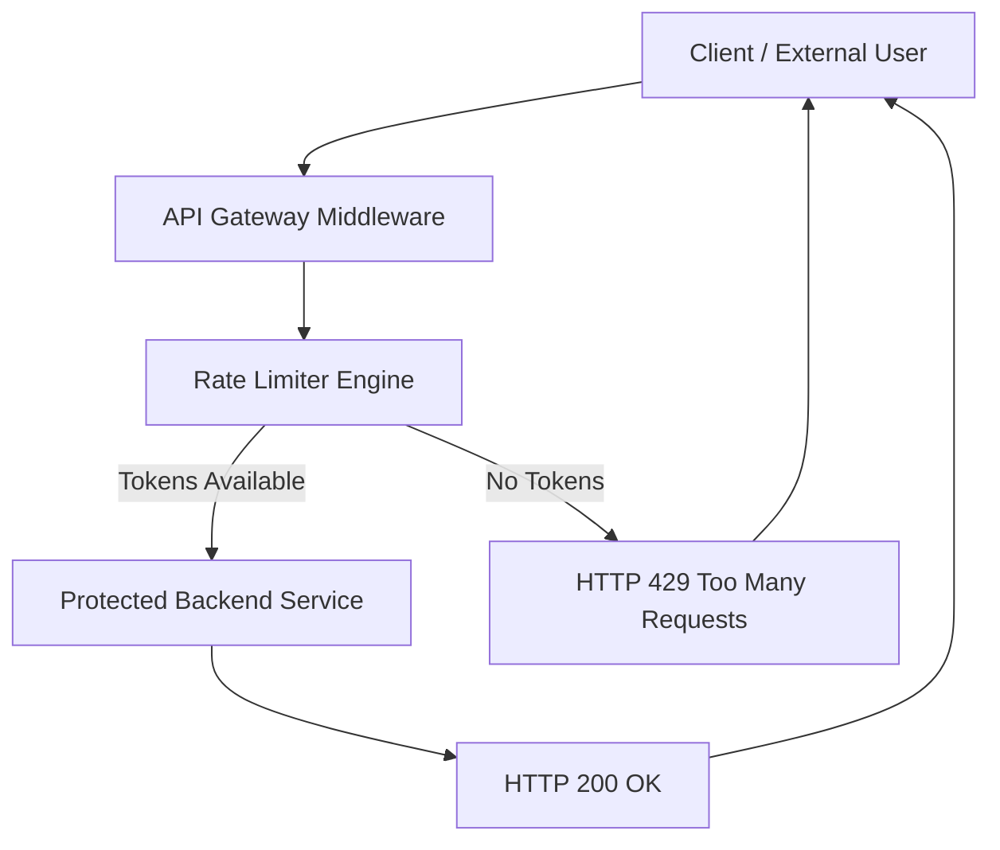
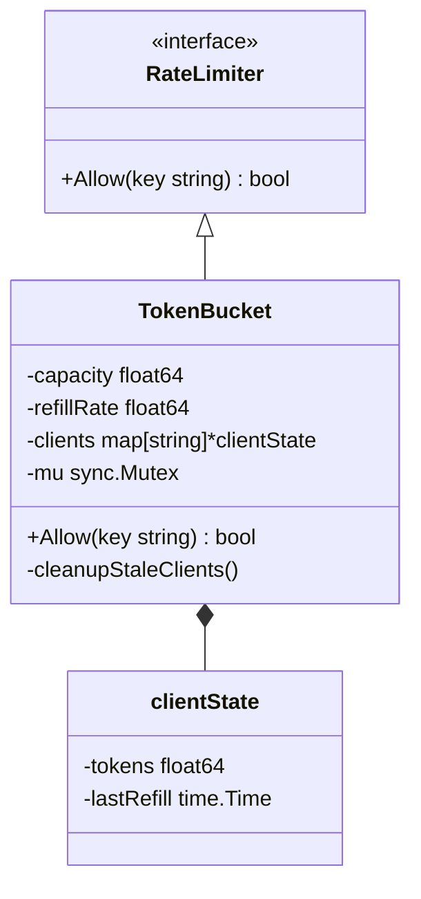

# Distributed API Gateway & Rate Limiter

An enterprise-grade, concurrent HTTP API Gateway featuring a custom-built, memory-safe Token Bucket rate limiting algorithm. Built entirely in Go to handle high-throughput edge routing with zero external dependencies.

---

# Core Features

- **Custom Token Bucket Algorithm:** Implements precise time-delta math for per-IP token refilling without relying on background ticker loops per user.
- **Thread-Safe State Management:** Utilizes Go `sync.Mutex` to prevent race conditions during high-concurrency request spikes.
- **Memory Leak Protection (GC Daemon):** Features a dedicated Goroutine that continuously sweeps and garbage-collects stale IP states to prevent Out-Of-Memory crashes under heavy load.
- **Middleware Architecture:** Strict separation between HTTP routing and rate limiting logic via Go interfaces.
- **Table-Driven Unit Testing:** Fully tested core logic verifying bucket exhaustion, IP isolation, and token refill accuracy.

---

#  High-Level Design (HLD)

The gateway acts as a reverse proxy shield. Every incoming request is intercepted by middleware, evaluated by the rate limiter, and either forwarded to the backend or rejected.



---

#  Low-Level Design (LLD)

The system follows the **Dependency Inversion Principle**.

- The HTTP layer depends only on a **RateLimiter interface**
- The **TokenBucket implementation** manages internal state and concurrency control.



---

# Getting Started

## 1. Clone the Repository

```bash
git clone https://github.com/yourusername/distributed-gateway.git
cd distributed-gateway
```

## 2. Run the API Gateway

```bash
go run cmd/gateway/main.go
```

The gateway will start on:

```
http://localhost:8080
```

---

#  Run the Test Suite

The project uses **table-driven unit tests** (standard Go testing practice).

Run all tests:

```bash
go test -v ./internal/limiter/...
```

---

#  Test the Rate Limiter

Send repeated requests to trigger the rate limiter.

```bash
curl -i http://localhost:8080/api/data
```

After exceeding the configured limit you should see:

```
HTTP/1.1 429 Too Many Requests
```

---

#  Project Structure

```
distributed-gateway
│
├── cmd
│   └── gateway
│       └── main.go
│
├── internal
│   └── limiter
│       ├── token_bucket.go
│       ├── rate_limiter.go
│       └── limiter_test.go
│
└── README.md
```

---

#  Testing Strategy

Tests validate:

- Token exhaustion behavior
- Independent rate limits per IP
- Accurate token refill calculations
- Concurrency safety

Run all tests:

```bash
go test ./...
```

---

#  Example Rate Limit Configuration

Example settings:

```
Capacity: 10 tokens
Refill Rate: 5 tokens per second
```

Behavior:

| Request Pattern | Result |
|----------------|--------|
| First 10 requests | Allowed |
| Additional requests | Rejected |
| After 1 second | 5 tokens refilled |

---

#  Production Use Cases

This gateway can be used for:

- API protection against **DDoS attacks**
- Enforcing **API rate limits**
- Acting as an **edge gateway**
- Multi-tenant **API quota management**
- Microservice traffic control

---

#  Build Binary

To build a production binary:

```bash
go build -o gateway cmd/gateway/main.go
```

Run it:

```bash
./gateway
```

---

#  Commit Documentation

```bash
git add README.md
git commit -m "docs: add architecture diagrams and project documentation"
```
