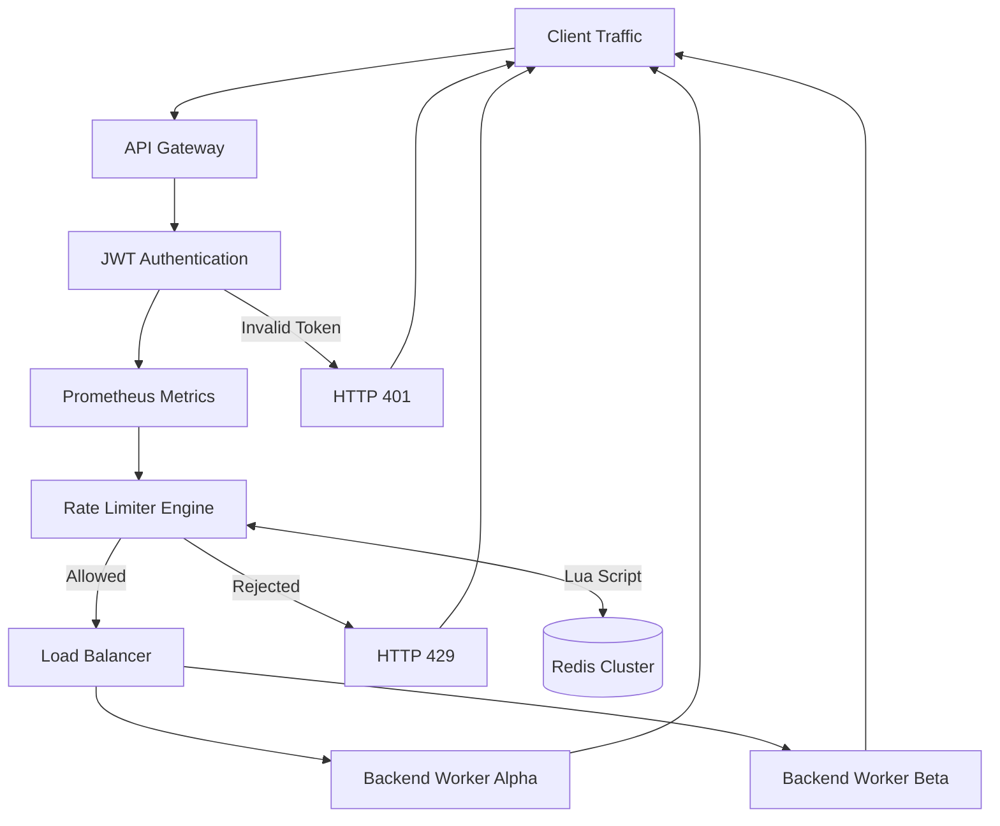
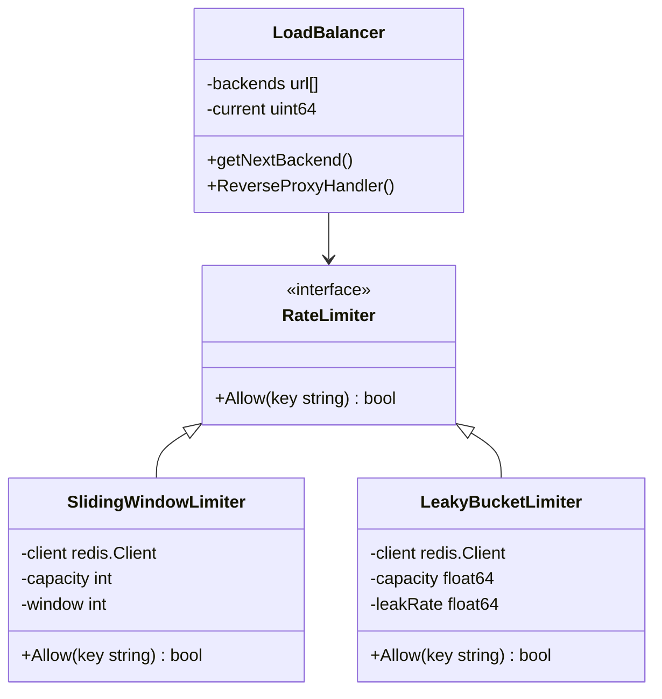

# Distributed Enterprise API Gateway & Rate Limiter

A high-throughput, horizontally scalable API Gateway engineered in Go. Designed to protect backend microservices from volumetric traffic spikes, malicious botnets, and resource exhaustion using distributed, mathematically rigorous rate-limiting algorithms.

This gateway features zero-downtime graceful shutdowns, atomic lock-free load balancing, real-time telemetry, and centralized state management via Redis Lua scripting to guarantee race-condition-free execution in high-concurrency environments.

Load Tested: 1000+ RPS

p99 latency: <7ms

---

# Core Architecture & Features

- **Distributed State via Redis Lua Scripts**  
  Eliminates data races and `sync.Mutex` bottlenecks across multiple gateway nodes by executing rate-limiting math atomically inside Redis.

- **Pluggable Rate Limiting Engine**  
  Implements the Dependency Inversion Principle, allowing instant switching between three algorithms:

  - **Token Bucket** – O(1) time-delta math permitting controlled bursts  
  - **Sliding Window (Redis ZSET)** – O(log N) strict boundary enforcement  
  - **Leaky Bucket** – Constant-rate traffic shaping for legacy systems

- **Thread-Safe Load Balancing**  
  Implements lock-free round-robin routing using Go's `sync/atomic` package.

- **JWT Authentication Middleware**  
  Prevents unauthorized requests from consuming backend CPU or memory.

- **Graceful Shutdown**  
  Intercepts `SIGINT` / `SIGTERM` signals and drains active connections before terminating.

- **Observability & Metrics**  
  Exposes a `/metrics` endpoint compatible with Prometheus to track:

  - Request throughput
  - Latency
  - Rate-limit rejection ratios

---

# High-Level Design (HLD)

The gateway operates as an ingress reverse proxy. Incoming requests pass through a middleware chain before being distributed to backend workers.



---

# Low-Level Design (LLD)

The architecture separates **transport logic from rate limiting state management**.



---

# Performance Benchmark (Vegeta)

The gateway was stress tested using **Vegeta** with **1,000 requests per second for 10 seconds**.

### Results

| Metric | Result |
|------|------|
| Throughput | 1,000 RPS sustained |
| Allowed Requests | 50 |
| Blocked Requests | 9,950 |
| Latency (p99) | < 7ms |
| Stability | 0 crashes, 0 dropped connections |

This demonstrates the gateway can **absorb attack traffic while protecting backend services**.

---

# Getting Started

## 1. Start the Distributed Cluster

```bash
docker-compose up --build -d
```

This launches:

- Redis
- Backend services
- API Gateway

---

# 2. Generate JWT Token

A CLI utility generates a valid token for testing.

```bash
go run cmd/jwtgen/main.go
```

Copy the generated token.

---

# 3. Send Requests

```bash
curl -i \
-H "Authorization: Bearer <TOKEN>" \
http://localhost:8080/api/data
```

You will observe:

- Traffic load balanced across backends
- Requests throttled after limit exceeded

---

# 4. View Metrics

```bash
curl http://localhost:8080/metrics
```

Prometheus-compatible metrics will be displayed.

---

# Project Structure

```
.
├── cmd
│   ├── gateway
│   │   └── main.go
│   └── jwtgen
│       └── main.go
│
├── internal
│   ├── api
│   │   ├── middleware.go
│   │   ├── load_balancer.go
│   │   └── metrics.go
│   │
│   └── limiter
│       ├── token_bucket.go
│       ├── sliding_window.go
│       └── leaky_bucket.go
│
├── docker-compose.yml
├── Dockerfile
└── README.md
```

---

# Build Binary

```bash
go build -o gateway cmd/gateway/main.go
```

Run the binary:

```bash
./gateway
```

---

# Example Rate Limit

```
Capacity: 5 requests
Refill Rate: 1 request / second
```

Behavior:

| Request Pattern | Result |
|----------------|--------|
| First 5 requests | Allowed |
| Additional requests | HTTP 429 |
| After 1 second | 1 token refilled |

